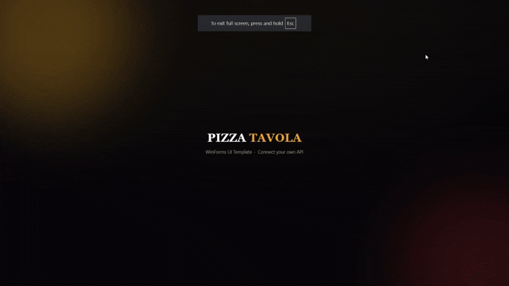

# Pizza Tavola — UI Template

A polished, ready-to-use WinForms ordering interface for a pizza restaurant — built as a **UI template** so any developer with a working API or database can plug in their own backend and ship a complete ordering app without designing the front end from scratch.

## Overview

This project is not a full ordering system — it's the front end. The screens, layout, and live price calculation logic are already built and working; what's missing on purpose is the backend (menu data source, order persistence, payment, etc.), left for whoever adopts this template to connect to their own API or database.

## What's already working

- **Live price calculation** — selecting a size, crust, and toppings updates the real total price instantly, calculated in code (not hardcoded)
- **Full ordering flow** — from a branded splash screen, through the menu, to a complete pizza customization screen (size, crust, toppings, dine-in/take-out)
- **Clean, restaurant-style visual design** — ready to present to a client as-is, or restyle

## What you're expected to customize

- **Form/screen names are placeholders** — rename them freely to fit your project structure
- **Menu items and prices** are currently set directly in code — swap them for values pulled from your own database or API
- **No backend included** — order submission, persistence, and payment are left for you to wire up

## Tech Stack

| Component | Technology |
|---|---|
| UI | C# · WinForms |
| Pricing logic | C# (calculated live from selected options) |

## Screens

The demo above shows the splash screen, the menu with pricing, and the interactive pizza builder with live total price updates.

## Getting Started

1. Clone the repository and open the solution in Visual Studio
2. Explore the pricing logic in code to see how selections map to the total price
3. Replace the hardcoded menu/pricing values with calls to your own API or database
4. Rename forms and wire up your backend logic (order submission, persistence, etc.)

## Author

**Meriouma Abdelhak**
Windows desktop application developer — C# · .NET · SQL Server

## License

This project is available under the MIT License.
